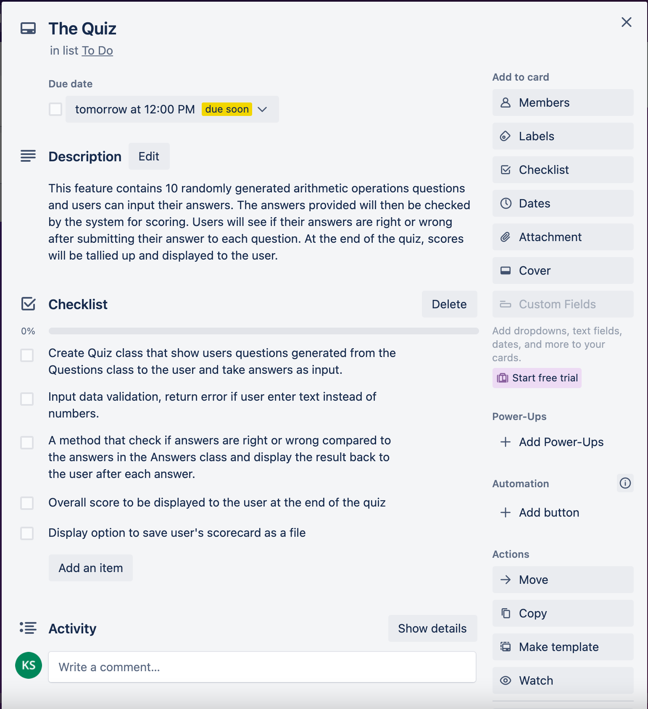

# Reference list
# GitHub Link
[GitHub Repo](https://github.com/kimbstocker/KimStocker_T1A3)
# Software Development Plan
## Purpose
- describe at a high level what the application will do
- identify the problem it will solve and explain why you are developing it
## Scope
- identify the target audience
- explain how a member of the target audience will use it
## Features
describe
- use of variables and the concept of variable scope
- loops and conditional control structures
- error handling

### Feature 1: The Quiz
This feature contains 10 randomly generated arithmetic operations questions and users can input their answers. The answers provided will then be checked by the system for scoring. Users will see if their answers are right(green) or wrong(red) after submitting their answer to each question. At the end of the quiz, scores will be tallied up and displayed to the user.
### Feature 2: Difficulty Levels
Users are offered with 3 quizzes with 3 difficulty levels
- Easy: each question in this level will be randomly generated from 2 arithmetic operators (either +, -, *), 2 single digit numbers and 1 double digit number. 
- Medium: this level include random questions with 2 arithmetic operators (either +, -, *), 1 single digit number and 2 double digit numbers.
- Hard: each question in this level will contain 3 arithmetic operators (either +,-,* or **), 1 single digit number, 2 double digit numbers and 1 triple digit number.
### Feature 3: Printing Scorecard
Once finished their quiz, users can print out their scorecard that list out all 10 questions, the correct answers, their answers and their scores for each questions as well as their overall score.

## Control Flow Diagram
- show the workflow/logic and/or integration of the features in your application for each feature.
- utilise a recognised format or set of conventions for a control flow diagram, such as UML.

## Software Developement Plan and Implementation
- outlines how each feature will be implemented and a checklist of tasks for each feature
  
  
  
  
- prioritise the implementation of different features, or checklist items within a feature
- provide a deadline, duration or other time indicator for each feature or checklist/checklist-item
-  Your checklists for each feature should have at least 5 items.
  

## Help Guide
- steps to install the application
- any dependencies required by the application to operate
- any system/hardware requirements